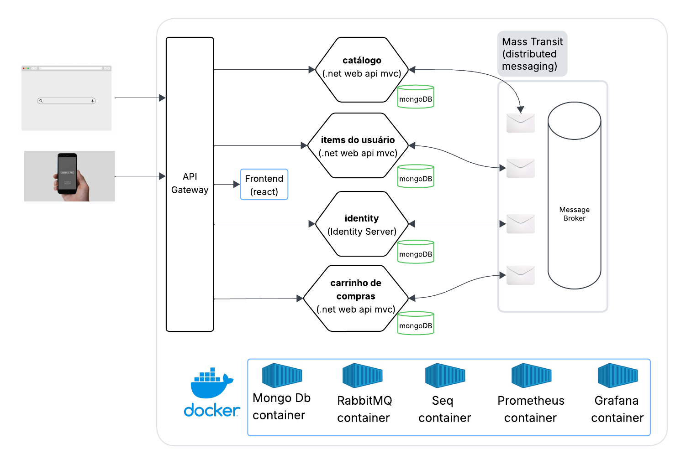
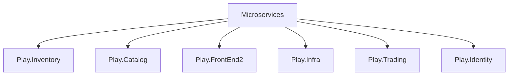

# .Net Core MVC API with MongoDB, RabbitMQ and React

## 📌 This project was built with:
- ASP.NET Core and C# for cross-platform server-side code
- Docker for services containerization
- MongoDB for database storage
- RabbitMQ and MassTransit for message-based asynchronous communication
- React for client-side rendering 

## 🎯 Purpose 
- integration between API, NoSQL database and Message Queue
- enable scalable and decoupled communication between services
- At the end we will have an archtecture like this:

   

---

## ⚙️ Requirements to Run the Project
Before running the project, make sure you have the following installed:

- [✅ .NET SDK 8.0.400](https://dotnet.microsoft.com/en-us/download)  
- [✅ Docker Desktop for Windows](https://www.docker.com/products/docker-desktop/)  
- [✅ Visual Studio Code](https://code.visualstudio.com/)
- [✅ npm](https://www.npmjs.com/)
- [✅ node](https://nodejs.org/pt) 

---

## To start, please, clone this projects:

## After having cloned, open VS Code terminal and folow these instructions:
#### go to Play.Infra project folder and execute:
```bash
  docker-compose up
```
#### split VS Code terminal:
go to
- Play.Inventory/src/Play.Inventor.Service folder
- Play.Catalog/src/Play.Catalog.Service folder
- Play.Identity/src/Play.Identity.Service folder
- Play.Trading/src/Play.Trading.Service folder

and execute:
```bash
  dotnet run
```
go to Play.FrontEnd project folder and execute:
```bash
  npm start
```
