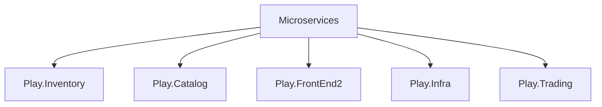

# React and .Net Core MVC API with MongoDB and RabbitMQ

## 📌 This project was built with:
- ASP.NET Core and C# for cross-platform server-side code
- Docker for services containerization
- MongoDB for database storage
- RabbitMQ and MassTransit for message-based asynchronous communication
- React for client-side rendering 

This project demonstrates integration between an API, a NoSQL database, and a message queue to enable scalable and decoupled communication between services.  

---

## ⚙️ Requirements to Run the Project
Before running the project, make sure you have the following installed:

- [✅ .NET SDK 8.0.400](https://dotnet.microsoft.com/en-us/download)  
- [✅ Docker Desktop for Windows](https://www.docker.com/products/docker-desktop/)  
- [✅ Visual Studio Code](https://code.visualstudio.com/)
- [✅ npm](https://www.npmjs.com/)
- [✅ node](https://nodejs.org/pt) 

---

## Clone Projects

## Open VS Code terminal
#### go to Play.Infra project folder and execute:
```bash
  docker-compose up
```
#### split VS Code terminal:
go to Play.Inventory, Play.Catalog and Play.Trading project folders and execute:
```bash
  dotnet run
```
go to Play.FrontEnd project folder and execute:
```bash
  npm start
```
