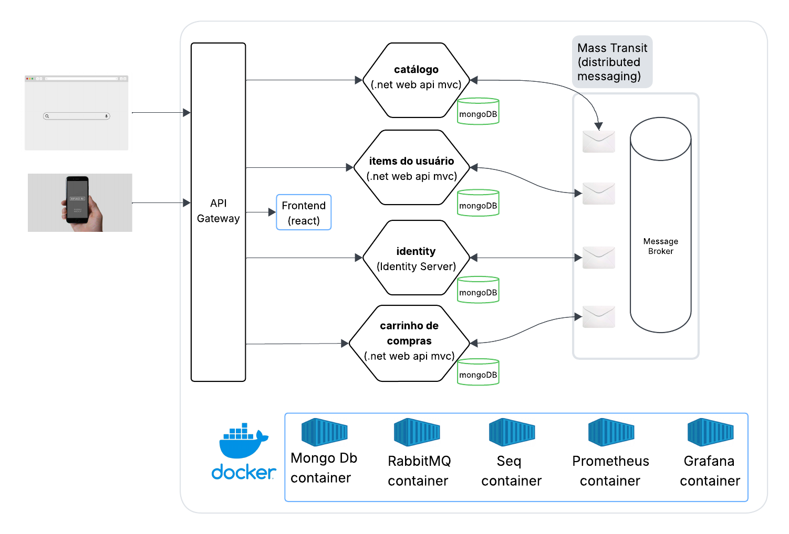
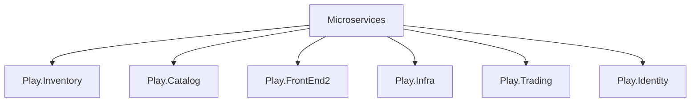

# Full-stack E-Commerce Application 

## The Context
E-commerce is no longer just an alternative to physical retail. It is the dominant growth engine for modern businesses.

### 🌐 **pt-br**:
```markdown
- Desafio: Necessidade de uma plataforma de e-commerce escalável para lidar com cargas variáveis de usuários durante picos de venda.
- Ação: Implementar uma arquitetura baseada em microsserviços com ASP.NET Core, MongoDB e RabbitMQ, containerização (Docker) para fácil escalabilidade e isolamento de falhas.
- Resultado: Um sistema resiliente, capaz de lidar com alto tráfego, com operações idempotentes para evitar pedidos duplicados.

```

## Why E-Commerce Matters

| Concept | Description |
|---------|------------|
|Global Market Reach | An e-commerce app operates 24/7, reaching customers across cities, countries, and continents|
| Scalability & Revenue Impact|Well-designed e-commerce platforms handle traffic spikes (e.g., Black Friday) and can grow from 100 to 1,000,000 users without major rewrites |
| Data-Driven Decisions| Every click, cart addition, and purchase generates data. This enables personalized recommendations, inventory optimization, and dynamic pricing—directly boosting conversion rates|
| Customer Experience as a Differentiator| Features like one-click checkout, real-time order tracking, and AI-powered search define brand loyalty. A poor experience leads to cart abandonment (nearly 70% of carts are lost).|
| Omnichannel Integration| Modern e-commerce connects web, mobile, social commerce (Instagram/Facebook shops), and even physical POS systems, creating seamless customer journeys.|

## The E-Commerce Archtecture
| Monolithic E-Commerce | Microservices E-Commerce|
|---------|------------|
| A monolithic e-commerce app works initially, but as you add features (reviews, payments, inventory, recommendations), it becomes fragile and hard to scale| Microservices solve this|
|Entire app crashes if one module fails (e.g., payments down = catalog also down) | Fault isolation – Payment service failure doesn't block browsing.|
|Scaling everything together (even if only checkout needs more resources) |Independent scaling – Scale just the order or payment service during sales. |
|One technology stack limits innovation |Polyglot persistence & languages – Use Node.js for real-time inventory, Python for ML recommendations, Go for high-throughput payments. |
|A small change requires redeploying the whole app |Decoupled deployments – Update the review service without touching checkout or user auth. |
|New team members struggle with massive codebase |Ownable domains – Each team (or future contributors) owns one service (e.g., Cart, Product, User). |
- As demonstraded in the table above, a Microservices archtecture seems to fit the E-Commerce scalability, modularity and deployability requirements.

## Microservices that will be built
| Service |Description |
|---------|------------|
| Product Catalog|Search, filters, product details. (High read load)|
|User & Auth | JWT tokens, social login, profiles|
|Cart| Store temporary items, merge carts across devices|
|Order|Submit orders, track status|
|Payment|Integrate Stripe/PayPal, handle idempotency|
|Inventory|Reserve stock, prevent overselling|
|Review & Rating|User-generated content, sentimen|
|Recommendation|ML-powered "customers also bought"|
|Notification|Email/SMS for order confirmations, abandoned carts|

   

## Tech Stack
- Backend: ASP.NET Core MVC and C#
- MongoDB
- Messaging: RabbitMQ with MassTransit
- Frontend: React
- IDE: vscode
- Testing: xUnit- 
- Container: Docker
- Archtecture: vertical slice
- Authentication/Autorization: Identity Server/JWT/Keykloack

## Running the Example
- [✅ .NET SDK 8.0.400](https://dotnet.microsoft.com/en-us/download)  
- [✅ Docker Desktop for Windows](https://www.docker.com/products/docker-desktop/)  
- [✅ Visual Studio Code](https://code.visualstudio.com/)
- [✅ npm](https://www.npmjs.com/)
- [✅ node](https://nodejs.org/pt) 
- clone this repositories:

```mermaid
graph TD
    A[Microservices]
    A --> B[Play.Inventory]
    A --> C[Play.Catalog]
    A --> D[Play.FrontEnd2]
    A --> E[Play.Infra]
    A --> F[Play.Trading]
    A --> G[Play.Identity]

```

**Repositories:**

- [Play.Inventory](https://github.com/leandro-mm/Play.FrontEnd.git)
- [Play.Catalog](https://github.com/leandro-mm/Play.Catalog.git)
- [Play.FrontEnd2](https://github.com/leandro-mm/Play.Inventory.git)
- [Play.Infra](https://github.com/leandro-mm/Play.Infra.git)
- [Play.Trading](https://github.com/leandro-mm/Play.Trading.git)
- [Play.Identity](https://github.com/leandro-mm/Play.Identity.git)

## After having cloned, open VS Code terminal and folow these instructions:
#### go to Play.Infra project folder and execute:
```bash
  docker-compose up
```
#### split VS Code terminal:
go to
- Play.Inventory/src/Play.Inventor.Service folder
- Play.Catalog/src/Play.Catalog.Service folder
- Play.Identity/src/Play.Identity.Service folder
- Play.Trading/src/Play.Trading.Service folder

and execute:
```bash
  dotnet run
```
go to Play.FrontEnd project folder and execute:
```bash
  npm start
```
